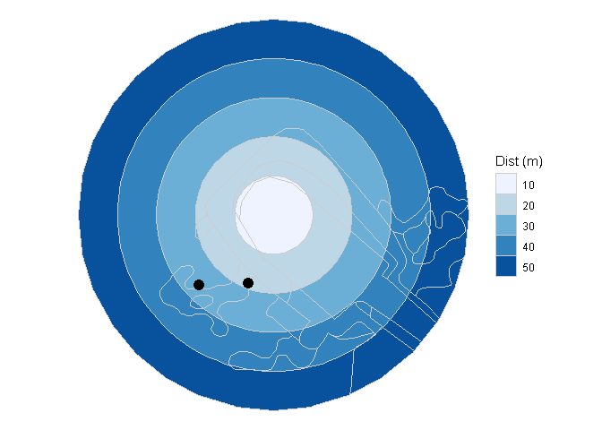

genestdwp [](https://https://travis-ci.org/PauloEduardoCardoso/genestdwp)[](https://codecov.io/gh/PauloEduardoCardoso/genestdwp?branch=master)[](https://zenodo.org/badge/latestdoi/237538088)
================

> GenestDwp helps to obtain the dwp (density weighted proportion) file
> required to run GenEst. It will work with the shapefiles for
> visibility map around each turbine and the carcass locations. Both
> layers will tipically be obtained from GIS. Visit the [package
> website](https://pecard.github.io/genestdwp/index.html)

## Disclaimer

This software is preliminary or provisional. No warranty, expressed or
implied, is made by the mantainer. Software releases constitute no
warranty. The software is provided as is on the condition that the
mantainer shall not be held liable or responsible for any damages
resulting from the authorized or unauthorized use of the software.

## What is GenEst?

GenEst is a generalized, unbiased, fatality estimator developed by
[USGS](https://www.usgs.gov/software/genest-a-generalized-estimator-mortality).
Additional information and details available from the [software User
Guide](https://doi.org/10.3133/tm7C19), the [package
repository](https://doi.org/10.5066/P9O9BATL), and the [technical
report](https://doi.org/10.3133/tm7A2). The material from a USGS “Into
to GenEst” workshop is also available
[here](https://www.usgs.gov/media/files/intro-genest-workshop-nwcc-26nov2018).

## Installation

You can install the released version of genestdwp from
[Github](https:://github.com/pecard/genestdwp) with:

``` r
library(devtools)
install_github("pecard/genestdwp")
```

## Contribute

You are welcome to contribute to the package development and improvment
by [filling an issue](https://github.com/pecard/genestdwp/issues) at the
package webpage.

## Usage

Run a basic example with the provided data:

``` r
library(genestdwp)
library(sf)
library(tidyverse)
# Vector of distances
dist = c(10, 20, 30, 40, 50) # assumming meters
# Spatial join among visibility map and rings
rings <- viring(x=visib, d = dist)
# Carcasses
pto_carcass
#> Simple feature collection with 54 features and 4 fields
#> geometry type:  POINT
#> dimension:      XY
#> bbox:           xmin: 128938.2 ymin: 267503.5 xmax: 133070.4 ymax: 276255.4
#> epsg (SRID):    20790
#> proj4string:    +proj=tmerc +lat_0=39.66666666666666 +lon_0=1 +k=1 +x_0=200000 +y_0=300000 +ellps=intl +towgs84=-304.046,-60.576,103.64,0,0,0,0 +pm=lisbon +units=m +no_defs
#> # A tibble: 54 x 5
#>       ag especie           grupo tamanho            geometry
#>  * <dbl> <chr>             <chr> <chr>           <POINT [m]>
#>  1     4 Accipiter nisus   Ave   grande  (129004.4 267938.1)
#>  2    33 Falco tinnunculus Ave   grande  (130302.3 270878.2)
#>  3     2 NI                Ave   grande  (128938.2 267503.5)
#>  4    17 Accipiter nisus?  Ave   grande  (133070.4 276255.4)
#>  5    15 Falco tinnunculus Ave   grande  (130588.9 270152.2)
#>  6    20 Falco tinnunculus Ave   grande  (131489.7 273364.7)
#>  7     1 Falco tinnunculus Ave   grande  (129293.7 268825.4)
#>  8    18 Falco tinnunculus Ave   grande  (132627.1 275476.3)
#>  9     1 Falco tinnunculus Ave   grande      (129281 268825)
#> 10    11 NI Corvideo       Ave   grande  (129573.4 269429.5)
#> # ... with 44 more rows
# Get DWP
dfdwp <- dwp(vr = rings, pt = pto_carcass)
#> [1] "Attention!"
#> # A tibble: 8 x 2
#>      ag visib
#> * <dbl> <chr>
#> 1    15 0    
#> 2     1 0    
#> 3     1 0    
#> 4     9 0    
#> 5    28 0    
#> 6    30 0    
#> 7    20 0    
#> 8    31 0    
#> [1] "Found n = 8 carcasses on visibility = 0! Assuming value of nearest visible area"
dfdwp
#> # A tibble: 37 x 2
#>       ag   dwp
#>    <dbl> <dbl>
#>  1     1 0.401
#>  2     2 0.440
#>  3     3 0.476
#>  4     4 0.540
#>  5     5 0.513
#>  6     6 0.690
#>  7     7 0.569
#>  8     8 0.435
#>  9     9 0.471
#> 10    10 0.410
#> # ... with 27 more rows
# Plot some data together
ggplot() +
  geom_sf(aes(fill = factor(dist)), colour = 'grey80',
          size = .1, data = filter(rings, ag == 1)) +
  geom_sf(data = filter(pto_carcass, ag == 1), size = 4) +
  scale_fill_brewer('Dist (m)') +
  theme_void()
```


